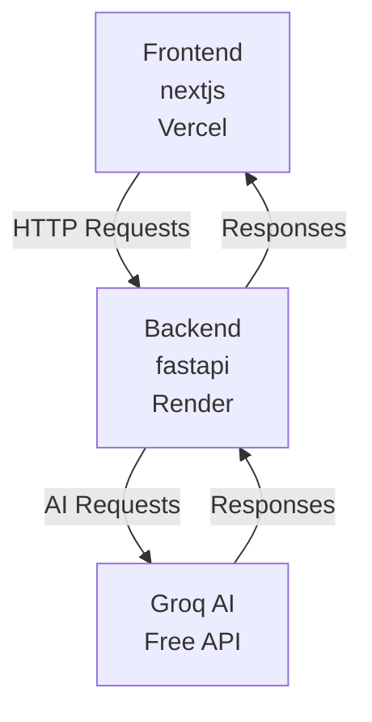

# Voice Bot Interview Assistant

## 📋 Project Overview

A simple voice-enabled chatbot that answers interview questions as YOU. Built for a job assessment with 100x AI Agent Team.

**Live Demo:** [To be added after deployment]

---

## 🎯 What It Does

1. User clicks microphone and speaks a question
2. Voice converted to text automatically
3. AI responds as you (with your personal context)
4. Response spoken back in voice
5. Chat history displayed
6. Clear logs button to reset

**No login, no setup, works in any browser!**

---

---

## 🏗 Architecture

### Simple & Serverless



### No Database
- Backend: Stateless, personal context in env variable
- Frontend: Chat history in React state (useState)
- Clear logs: Just resets state array

---

## 🛠 Tech Stack

### Backend
- Python 3.11
- FastAPI (web framework)
- Groq API (free AI)
- Deployed on Render (free tier)

### Frontend
- Next.js 14
- TypeScript
- Tailwind CSS
- Web Speech API (browser built-in)
- Deployed on Vercel (free tier)

### Cost: $0/month (all free tiers!)

---

## 🚀 Quick Start

### Prerequisites
- Python 3.11+
- Node.js 18+
- Groq API key (free from https://console.groq.com)

### Backend Setup
```bash
cd backend
python -m venv venv
source venv/bin/activate  # On Windows: venv\Scripts\activate
pip install -r requirements.txt
cp .env.example .env
# Edit .env with your Groq API key and personal context
uvicorn main:app --reload
```

Backend runs on http://localhost:8000

### Frontend Setup
```bash
cd frontend
npm install
cp .env.example .env.local
# Edit .env.local with backend URL
npm run dev
```

Frontend runs on http://localhost:3000

---

## 📁 Project Structure

```
DigitalBio/
├── README.md                 # This file
├── backend/
│   ├── main.py              # FastAPI app & routes
│   ├── config.py            # Configuration & env variables
│   ├── services/
│   │   └── llm_service.py   # Groq AI integration
│   ├── models/
│   │   └── schemas.py       # Request/response models
│   ├── requirements.txt     # Python dependencies
│   ├── .env.example         # Environment template
│   └── Procfile             # Render deployment config
└── frontend/
    ├── package.json         # Node dependencies
    ├── next.config.js       # Next.js config
    ├── app/
    │   ├── layout.tsx       # Root layout
    │   ├── page.tsx         # Home page
    │   └── globals.css      # Global styles
    └── components/
        └── VoiceChat.tsx    # Main voice chat component
```

---

## 🎓 SOLID Principles

Every file and function has a single, clear responsibility:

- **Single Responsibility:** Each service/component has one job
- **Open/Closed:** Easy to extend without modifying existing code
- **Liskov Substitution:** Can swap AI providers easily
- **Interface Segregation:** Minimal, focused interfaces
- **Dependency Inversion:** Depends on abstractions (env vars), not concrete implementations

Each service/component has a clear, single responsibility.

---

## 🔧 API Documentation

### Backend Endpoints

#### Health Check
```
GET /
Response: "OK"
```

#### Chat
```
POST /api/chat
Request: { "message": "What is your superpower?" }
Response: { "response": "My superpower is...", "status": "success" }
```

---

## 🧪 Testing

### Backend
```bash
# Health check
curl http://localhost:8000/

# Chat test
curl -X POST http://localhost:8000/api/chat \
  -H "Content-Type: application/json" \
  -d '{"message": "Tell me about yourself"}'
```

### Frontend
1. Open http://localhost:3000
2. Click microphone button
3. Grant permission
4. Speak: "What is your superpower?"
5. Verify response appears and is spoken
6. Click "Clear Chat"
7. Verify messages cleared

---

## 🌐 Deployment

**Quick summary:**
1. Get Groq API key (5 min)
2. Deploy backend to Render (15 min)
3. Deploy frontend to Vercel (10 min)
4. Update CORS settings (5 min)
5. Test live app (10 min)

**Total: 45 minutes**

---

## 🎯 Features

### Core Features ✅
- Voice input (Web Speech API)
- AI responses (Groq)
- Voice output (Text-to-Speech)
- Chat history display
- Clear logs button
- Mobile responsive

### Not Included (Intentionally Simple) ❌
- User authentication
- Database/persistence
- Session management
- Analytics
- Complex state management

---

## 🔒 Security

- API keys in environment variables (never committed)
- CORS configured for specific domains
- Input validation with Pydantic
- HTTPS in production (automatic on Vercel/Render)
- No data persistence (privacy-friendly)

---

## 📝 Personal Context Setup

Add your interview answers to backend `.env` file:

```bash
PERSONAL_CONTEXT="
Life Story: [Your 2-3 sentence background]

Superpower: [Your #1 superpower]

Growth Areas:
1. [Area 1]
2. [Area 2]
3. [Area 3]

Misconception: [What coworkers get wrong about you]

Boundaries: [How you push your limits]
"
```

These answers are embedded in the AI system prompt.

---

## 🐛 Troubleshooting

### Microphone not working
- Grant browser permission
- Use HTTPS (required for Web Speech API)
- Try Chrome/Safari (best support)

### CORS errors
- Verify backend `CORS_ORIGINS` includes frontend URL
- Check for `https://` prefix
- Redeploy after changes

### Slow responses
- Render free tier has cold starts (~30 seconds after inactivity)
- This is normal - first request wakes up the server
- Subsequent requests are fast (1-2 seconds)

---

## 📊 Performance

- **Response Time:** 1-2 seconds (Groq is very fast)
- **Bundle Size:** ~100KB (minimal frontend)
- **Cold Start:** ~30 seconds (Render free tier)
- **Memory:** ~50-100 MB backend, ~10 MB frontend

---

## 🎉 Submission

**To:** bhumika@100x.inc
**Subject:** "GEN AI: GEN AI ROUND 1 ASSESSMENT (LINKEDIN)"
**Include:**
- Live demo URL
- This GitHub repo (optional)
- Your resume

---

## 📞 Support

For questions about:
- **Project:** Check documentation files above
- **Render:** https://render.com/docs
- **Vercel:** https://vercel.com/docs
- **Groq API:** https://console.groq.com/docs

---

## ⏱ Development Timeline

| Phase | Time |
|-------|------|
| Planning & Documentation | 1 hour |
| Backend Development | 2 hours |
| Frontend Development | 2 hours |
| Integration & Testing | 1 hour |
| Deployment | 1 hour |
| **Total** | **7 hours** |

---

## ✅ Pre-Submission Checklist

- [ ] Backend deployed and accessible
- [ ] Frontend deployed and accessible
- [ ] Voice input works
- [ ] AI responses are personalized
- [ ] Voice output works
- [ ] Clear logs works
- [ ] Tested on desktop browser
- [ ] Tested on mobile device
- [ ] No console errors
- [ ] CORS configured correctly
- [ ] Personal context added to backend env
- [ ] URL is shareable (not localhost)

---

## 📄 License

Created for 100x AI Agent Team interview assessment.

---

## 🙏 Acknowledgments

- **100x Team** - For the opportunity
- **Groq** - For free AI API
- **Vercel** - For free hosting
- **Render** - For free hosting

---

**Built with simplicity and SOLID principles in mind.**
